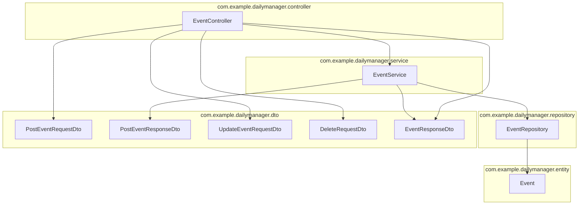

# 일정관리 앱 API

## 소개
이 프로젝트는 일정관리 앱의 API를 구현하라는 내일배움캠프 스프링 프레임워크의 기초적인 지식을 활용해보는 과제이다.
API의 요구사항에 맞게 동작하게 구현하고, API 명세에 맞게 응답을 반환하도록 구현하는 작업을 주요 목적으로 한다.
그리고 JAVA를 이용하여 SOLID 원칙을 지키면서 객체지향적으로 설계하며 스프링의 기본적인 구조인 3계층 아키텍처에 대한 이해를 다지는 것을 목적으로 한다.

## 사용된 기술 및 라이브러리
아래와 같은 기술과 라이브러리를 사용하여 프로젝트를 구현하였다.

- Java 17
- Spring Boot 4.0.5
- Spring Data JPA
- MySQL & MySQL Driver
- Spring Security
- gradle
- Spring Validation Starter <- 쓰지말라는거 못보고 써버림

## 프로젝트 구조

이 프로젝트는 Spring Boot 기반 3계층 구조로 구성되어 있으며, 비즈니스 로직은 `Event` 중심으로 동작한다.

### 구조 요약

- `controller`
  - HTTP 요청/응답을 처리한다.
  - `EventController`가 `/events` 관련 API를 담당한다.
- `service`
  - 비즈니스 로직과 권한 검증을 담당한다.
  - `EventService`가 비밀번호 검증, 생성, 수정, 삭제, 조회 로직을 처리한다.
- `repository`
  - JPA를 통해 DB 접근을 담당한다.
  - `EventRepository`는 `Event` 조회 및 정렬 쿼리를 제공한다.
- `entity`
  - DB 테이블과 매핑되는 도메인 객체이다.
  - `Event`는 생성일/수정일과 비밀번호를 포함한다.
- `dto`
  - 요청/응답 데이터 전달용 객체이다.
  - 요청 DTO와 응답 DTO를 분리하여 사용한다.
- `config`
  - 보안 및 암호화 같은 공통 설정을 담당한다.
  - `SecurityConfig`는 `PasswordEncoder`와 인증 설정을 제공한다.

## API 명세

- TBA

## ERD
- TBA

## 실행 방법
본 API는 실제 배포목적으로 만들어진 것이 아니므로, 로컬 환경에서 실행하는 것을 기준으로 설명한다.

1. MySQL DB 실행
    - MySQL이 설치되어 있지 않다면, MySQL을 설치하고 실행한다.
    - DB는 위 프로젝트의 ERD에 맞게 생성될 것이며 더미 데이터는 추후에 추가할 예정이다.
    - DB 접속 정보는 `application.properties` 파일에서 설정할 수 있다.
2. 프로젝트 실행
윈도우와 Unix-like 시스템으로 구분한다. 터미널에서 실행을 기준으로 설명한다.
    - Windows
        - `gradlew.bat bootRun` 명령어를 사용하여 프로젝트를 실행한다.
    - Unix-like 시스템 (Linux, macOS 등)
        - `./gradlew bootRun` 명령어를 사용하여 프로젝트를 실행한다.

## 기타 사항
리포지토리는 평가 목적으로 만들어진 것이므로, 평가 후에는 비공개로 전환된다.

단, 리포지토리  소유자의 판단하에 따라 공개로 유지될 수도 있다.